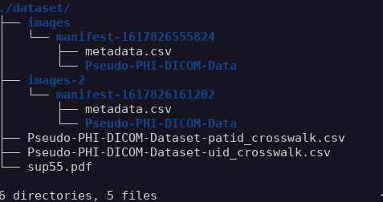

# MIDI-B Challange DKFZ

## Download the data

https://wiki.cancerimagingarchive.net/pages/viewpage.action?pageId=80969777


### Install dependecies
install the dependency packages using poetry

```
poetry install --no-root
```

### Running Jupyter notebooks

* First install jupyter notebook globally using pip. [pip package](https://pypi.org/project/jupyter/)
* Add Current poetry environment to the jupyter notebook kernels by running following command.
```
poetry run python -m ipykernel install --user --name dcm-deid
```
* Run Jupyter notebook by running following command in terminal.
```
jupyter notebook
```
* Open the notebooks in Browser from Jupyter notebook starting page. Select the `dcm-deid` kernel in notebook, in case it by default select some other kernel to run those notebooks.


### Dataset Directory

Notebooks required the dataset from TCIA to be downloaded. These two dataset and mapping files needs to be downloaded and placed in a folder as following. Get the data from [here](https://www.cancerimagingarchive.net/collection/pseudo-phi-dicom-data/).



Raw images are placed under `images` directory and de-identified images are placed under `images-2` directory,
